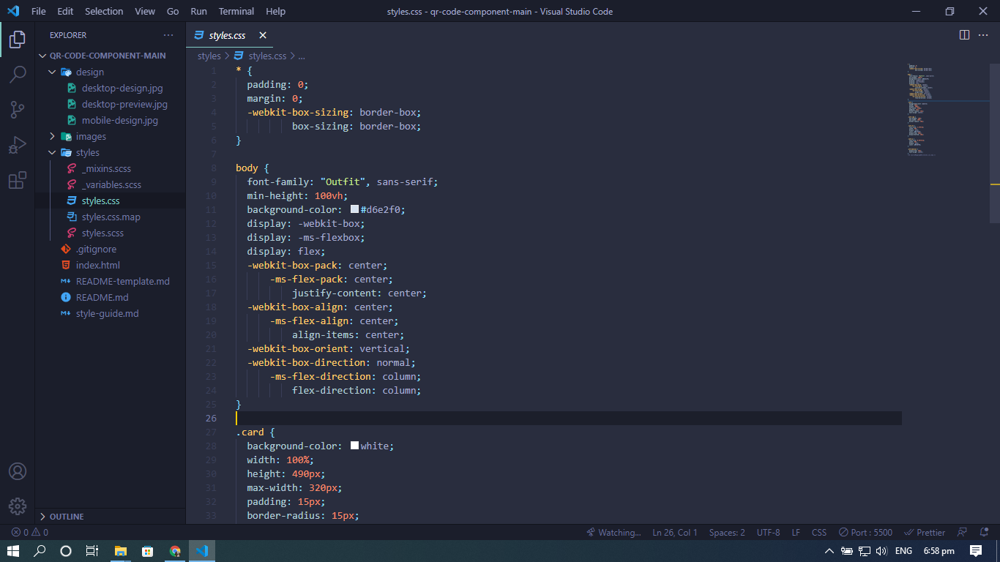
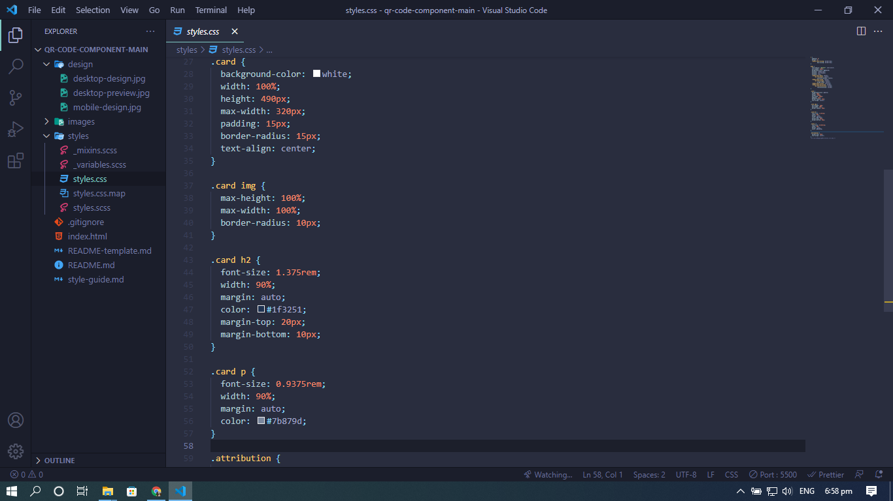
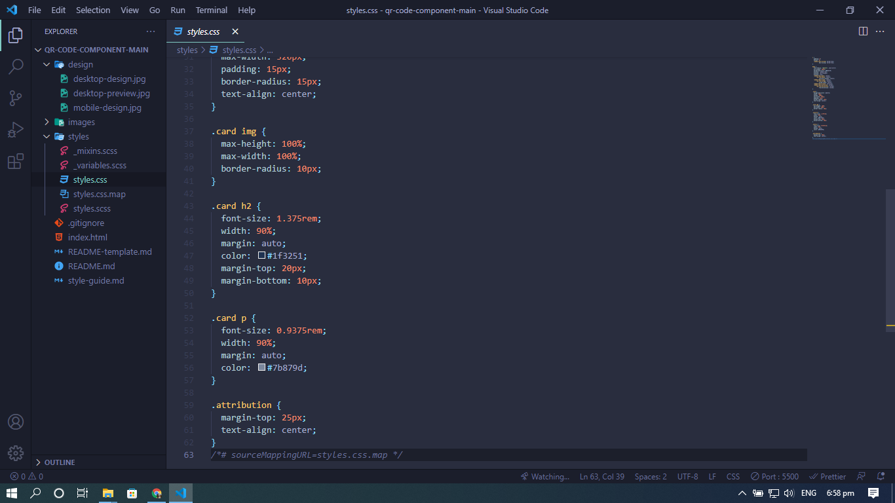

# Frontend Mentor - QR code component solution

This is a solution to the [QR code component challenge on Frontend Mentor](https://www.frontendmentor.io/challenges/qr-code-component-iux_sIO_H). Frontend Mentor challenges help you improve your coding skills by building realistic projects.

## Table of contents

- [Overview](#overview)
  - [Screenshot](#screenshot)
  - [Links](#links)
- [My process](#my-process)
  - [Built with](#built-with)
  - [What I learned](#what-i-learned)
  - [Continued development](#continued-development)
- [Author](#author)
- [Acknowledgments](#acknowledgments)

## Overview

### Screenshot





### Links

- Solution URL: [Add solution URL here](https://your-solution-url.com)
- Live Site URL: [Add live site URL here](https://your-live-site-url.com)

## My process

### Built with

- Semantic HTML5 markup
- CSS custom properties
- Flexbox
- CSS Grid
- Mobile-first workflow
- SASS

### What I learned

What I learned is that I was able to center contents by using flexbox. I have a hard time understanding flexbox and It made me happy to be able to fully understand it. I am also very happy to apply what I learned from SASS.

```css
body {
  font-family: "Outfit", sans-serif;
  min-height: 100vh;
  background-color: #d6e2f0;
  display: -webkit-box;
  display: -ms-flexbox;
  display: flex;
  -webkit-box-pack: center;
  -ms-flex-pack: center;
  justify-content: center;
  -webkit-box-align: center;
  -ms-flex-align: center;
  align-items: center;
  -webkit-box-orient: vertical;
  -webkit-box-direction: normal;
  -ms-flex-direction: column;
  flex-direction: column;
}
```

### Continued development

I would like to continue learning flexbox and also SASS.

## Author

- Frontend Mentor - [@surigaoadrian](https://www.frontendmentor.io/profile/surigaoadrian)
- Twitter - [@adreyanjan](https://twitter.com/adreyanjan)

## Acknowledgments

I would like to give thanks to all web developer youtubers that provide free tutorials for us aspiring web developers.
